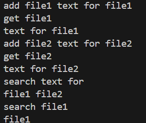
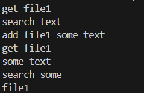
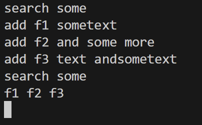

# drive-project-
# Project Setup:
The app starts with the main function that make instances of all the commands and the CLIMenu and run the App with them.

The App class has run function which is being called by the main.
The run function is an infinite loop that calls the nextCommand() function of the IMenu and gets the arguments from the user (in the CLIMenu the user input is from the CLI).
The it tries to run a command from the command map with those arguments.
If it finds the command it calls the execute function with the arguments.
If it fails to execute or such a command does not exist it calls the displayError function (in the CLIMenu it does nothing).
This loop is being repeated forever.

ICommand.h is the interface for the command design pattern that is being implemented by each command.

IMenu.h is the interface for all the types of menues that will be supported. For now it is only implemented by CLIMenu.

CLIMenu is the IMenu for getting user input from the CLI. The nextCommand function reads the user input and seperates it by spaces to get all the arguments for the coommand.

The sub-directory "core" of "src" (src/core) contains all code related to running the app (for example: all menu related, app.cpp, main.cpp ...).

The sub-directory "commands" of "src" (src/commands) contains all command related code (for example: ICommand,addCommand, getCommand ...).

The sub-directory "compression" of "src" (src/compression) contains all compression related code.

The sub-directory "storage" of "src" (src/storage) contains all code related to handling all file operations like saving and creating new file, extracting data out of file... (should be used by the commands like add , get ...).

# Storage Manager

The class storageManager is responsible for all file related operation in the program, manage a directory where all compressed files are stored.
The load function extract the data from a given file path.
The save function creates a file named fileName and write the received data in it.
The listFiles function list all files in the storage path and return them as a vector of strings.
The fileExists function checks if a file named fileName exists in the storage path.

# Storage Dispatcher

The Storage Dispatcher is a small component responsible for deciding which storage instance a connected client should use. The server delegates this decision to the dispatcher.   

This design keeps the server open for extension and closed for modification.   
In Exercise 2, we use a simple implementation (ConstStorageDispatcher) that returns one shared StorageManager for all clients.

# Compressor

This RLE compressor have compress and decompress methods to perform the RLE compression.

CompressorTests are tests for this compressor.

# Client Handler
ClientHandler is responsible for managing a single client connection.   
It receives a ClientInfo object (containing the client’s socket and metadata) and controls the entire request–response flow.   

During a client session, the handler:

1) Creates a SocketMenu to read commands from the socket and send responses back.
2) Creates an InputManager to validate and parse the client’s input.
3) Creates all command objects (post, get, search, etc.) and stores them in a command map.
4) Initializes an App object with the menu, commands, and input manager, and runs it.
5) Cleans up all allocated resources after the client session ends.

Each connected client receives its own ClientHandler instance.   
When the client disconnects, the handler finishes its execution, releases its resources, and is deleted by the dispatcher.

# Thread per Client Dispatcher
The dispatcher decides how client handlers run.   
In Exercise 2 we use the Thread-Per-Client model:   
When a new client connects, the server creates a ClientHandler.   
The dispatcher launches a new thread for that handler.   
Inside the thread, the handler runs handle() and processes all requests.   
After the handler finishes, the dispatcher deletes it.   

This design keeps the server responsive because each client runs independently on its own thread.

# Commands

**Add Command** (`add [file name] [text]`)
This command handles the creation of new files. It receives a file name and text content from the user. Before saving, it uses the `Compressor` to compress the text using the RLE algorithm. Then, it uses the `storageManager` to save the compressed data to the disk.

**Get Command** (`get [file name]`)
This command retrieves file content. It verifies if the file exists using `storageManager`, loads the compressed content, and uses the `Compressor` to decompress it back to the original text before printing it to the output.

**Search Command** (`search [text]`)
This command searches for a specific string within all stored files. It gets the list of all files from `storageManager`, and for each file, it loads and decompresses the content. It then checks if the search text appears in the decompressed content and prints the file name if a match is found.

# Dockerfiles

The Dockerfile.tests and CMakeLists.txt are necessary to build and run the tests.

You can run all the app test files by typing 'docker build -f Dockerfile.tests -t  [some-container-name-for-tests] .' and then run it with 'docker run -t [some-container-name-for-tests]'.

The Dockerfile.app is necessary to run the app itself.

To run the app itself type 'docker build -f Dockerfile.app -t  [some-container-name-for-app] .' and then run it with
'docker run -it [some-container-name-for-app]'.

To run the cpp client tests type 'docker build -f Dockerfile.cppclienttests -t [some-container-name-for-cpp-client-tests] .' to build, and then run it with 'docker run [some-container-name-for-cpp-client-tests]'

To run the cpp client type 'docker build -f Dockerfile.cppclient -t [some-container-name-for-cpp-client] .' to build, and then
run it with 'docker run -it [some-container-name-for-cpp-client] [first-argument] [second-argument]'
Build the python client by 'docker build -f Dockerfile.pyclient -t  [some-container-for-python-client] .' and then run with
'docker run -it [some-container-for-python-client] [arg1] [arg2]'

to run docker-compose (for running the whole project), firstlly do: docker compose up -d --build  to build and run the server on background.   
then do: docker compose run --rm client-cpp server 12345 to run client cpp code   
or  docker compose run --rm client-py server 12345 to run client python code.

# Run Examples

